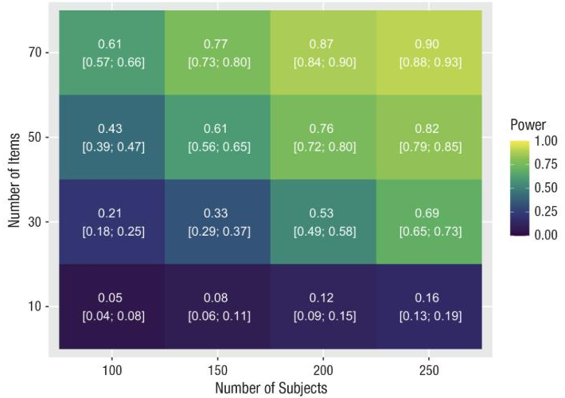

Many experiments in psychology have a nested structure: each participant responds to many items, and both participants and items vary. **Generalized linear mixed models (GLMMs)** handle such data well – including binary outcomes such as correct versus incorrect decisions. Planning the sample size for these models, however, is difficult: existing software only covers specific designs, and directional hypotheses that combine several comparisons are hardly supported at all.

#### What we did

Together with Florian Pargent, Timo K. Koch, Eva Lermer, and Susanne Gaube, I co-authored a hands-on tutorial on **tailored, simulation-based sample-size planning**. The running example is a human–AI interaction experiment: radiologists and medical students diagnose bleedings in head CT scans with or without AI advice, and the advice can be correct or incorrect. The tutorial walks through all steps – defining the estimand, simulating the data-generating process, choosing plausible population parameters, fitting the model, and repeating the simulation many times – and provides R code for each of them.

#### What it shows

- Simulations make it possible to plan sample sizes for exactly the design and hypotheses at hand, including several directional comparisons that must hold simultaneously.
- Besides classical **power analysis**, the tutorial shows how to plan for **precision**, that is, for a desired width of the confidence intervals.
- In the case study, a power of about .80 required, for example, 250 participants who each respond to 50 items, or 200 participants who respond to 70 items – illustrating the trade-off between the number of participants and the number of items.

<figure class="ak-figure">

<figcaption>Simulation-based power estimates (with 95% confidence intervals) for different numbers of subjects and items. Figure 4 from Pargent et al. (2024), <em>Advances in Methods and Practices in Psychological Science</em>, licensed under <a href="https://creativecommons.org/licenses/by/4.0/">CC BY 4.0</a>.</figcaption>
</figure>

#### What this means

Simulation-based planning takes more thought than plugging numbers into a calculator, but it forces researchers to make their assumptions explicit – and it works for the complex designs we actually run. We argue that it should become a standard part of methods training.

#### Read the paper

Pargent, F., Koch, T. K., **Kleine, A.-K.**, Lermer, E., & Gaube, S. (2024). A tutorial on tailored simulation-based sample-size planning for experimental designs with generalized linear mixed models. *Advances in Methods and Practices in Psychological Science, 7*(4). [https://doi.org/10.1177/25152459241287132](https://doi.org/10.1177/25152459241287132)
