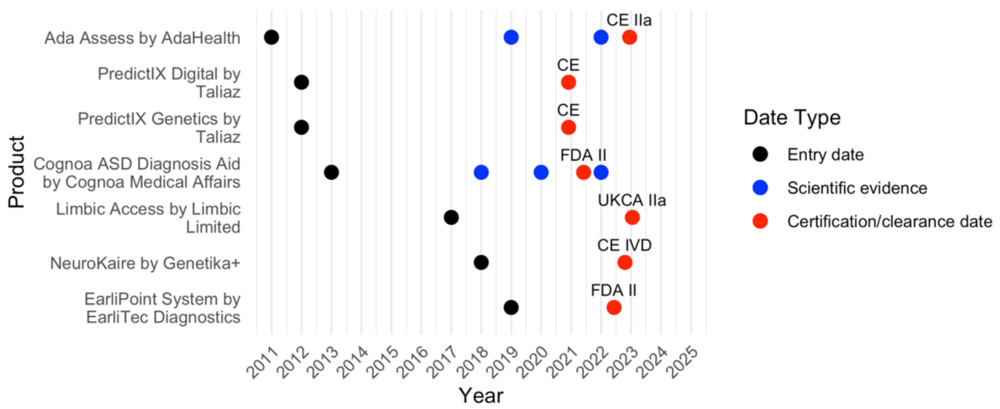

Many AI tools for mental healthcare are developed and patented (see our [patent review]()), but which of them have actually obtained **regulatory approval** and can be used in clinical practice? Information on regulated AI-enabled clinical decision support systems (AI-CDSS) is scattered across manufacturers' websites, regulatory databases, and scientific articles. With this review, we wanted to make the market more transparent.

#### What we did

We systematically searched for regulated AI-CDSS for mental healthcare, contacted vendors for missing information, and reviewed the products' characteristics, regulatory status, and the scientific evidence on their performance. We assessed the reporting quality of the available studies with the CONSORT-AI checklist.

#### What we found

- Of **84 potential products, seven** fulfilled the inclusion criteria.
- The products fall into three areas: diagnosing **autism spectrum disorder** based on clinical history, behavioral, and eye-tracking data; diagnosing **multiple disorders based on conversational data**; and **medication selection** based on clinical history and genetic data.
- We found only **five scientific articles** evaluating the devices' performance and external validity.
- On average, these articles adhered to **52% of the CONSORT-AI** reporting items – modest reporting quality with clear room for improvement.

<figure class="ak-figure">

<figcaption>Firm entry dates, dates of published scientific evidence, and certification or clearance dates of the reviewed products. Figure 2 from Kleine et al. (2025), <em>Artificial Intelligence in Medicine</em>, licensed under <a href="https://creativecommons.org/licenses/by/4.0/">CC BY 4.0</a>.</figcaption>
</figure>

#### What this means

Regulatory approval and scientific evaluation do not always go hand in hand. Clinicians, patients, and policymakers need transparent information about which tools are approved and how well they perform. Refining regulatory guidelines and introducing effective tracking systems for AI-CDSS could improve oversight in this fast-moving field.

#### Read the paper

**Kleine, A.-K.**, Kokje, E., Hummelsberger, P., Lermer, E., Schaffernak, I., & Gaube, S. (2025). AI-enabled clinical decision support tools for mental healthcare: A product review. *Artificial Intelligence in Medicine, 160*, 103052. [https://doi.org/10.1016/j.artmed.2024.103052](https://doi.org/10.1016/j.artmed.2024.103052)
