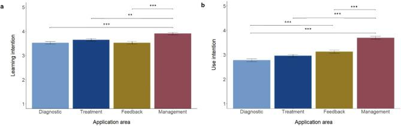

The demand for mental healthcare far exceeds the available therapeutic resources, and AI-enabled technologies may help to support and deliver care. But how familiar are practitioners with these technologies, and who intends to learn about and use them? In this preregistered study led by Julia Cecil, we looked at four application areas: **diagnostics, treatment, feedback, and practice management**.

#### What we did

We surveyed **392 mental health practitioners** from Germany (n = 236) and the United States (n = 156) – psychotherapists (in training), psychiatrists, and clinical psychologists. We analyzed open answers about their understanding of AI with a deductive thematic approach, and we used structural equation modeling to relate practitioners' characteristics (e.g., AI readiness, AI anxiety, technology self-efficacy, affinity for technology, and professional identification) to their learning and use intentions.

#### What we found

- There is a substantial **familiarity gap**: 45% had never heard of AI-enabled technologies in psychotherapy or psychiatry, only about 10% had actively looked into the topic, and 93% had never used such tools in practice.
- **Learning intentions were higher than use intentions.** Both were highest for practice management tools and lowest for diagnostic tools – practitioners were more hesitant about patient-centred than about therapist-centred applications.
- Across all four application areas, **learning intention, ethical knowledge, and affinity for technology interaction** were relevant predictors.
- Psychiatrists reported higher intentions than the other professional groups, and practitioners in Germany reported lower learning intentions than those in the US.

<figure class="ak-figure">

<figcaption>(a) Learning intentions and (b) use intentions across the four application areas. Figure 3 from Cecil et al. (2025), <em>BMC Health Services Research</em>, licensed under <a href="https://creativecommons.org/licenses/by/4.0/">CC BY 4.0</a>.</figcaption>
</figure>

#### What this means

Before AI can be implemented in mental healthcare, practitioners need opportunities to learn about it – including its ethical implications. Training programs that build knowledge and address concerns are a promising first step toward responsible adoption.

#### Read the paper

Cecil, J., **Kleine, A.-K.**, Lermer, E., & Gaube, S. (2025). Mental health practitioners' perceptions and adoption intentions of AI-enabled technologies: An international mixed-methods study. *BMC Health Services Research, 25*, 556. [https://doi.org/10.1186/s12913-025-12715-8](https://doi.org/10.1186/s12913-025-12715-8)
