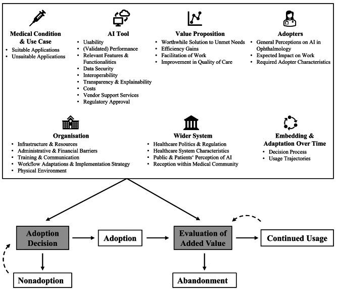

AI could ease the growing workload in ophthalmology, and several AI-enabled clinical decision support systems (AI-CDSS) have already received regulatory approval. Yet they are rarely used in practice. In this preregistered study led by Insa Schaffernak, we asked what it takes for ophthalmology professionals to **adopt** these tools and to **keep using** them.

#### What we did

We conducted semi-structured interviews with **22 ophthalmology professionals** from Germany, Austria, and Switzerland – residents, attending physicians, heads of department, assistants, optometrists, and study nurses – with very different levels of experience with AI. We analyzed the interviews with a qualitative content analysis guided by the **NASSS framework** (Nonadoption, Abandonment, Scale-up, Spread, and Sustainability).

#### What we found

- Most participants were **open to AI**, especially as a complement to their own expertise – as a second opinion for complex cases, or as support for easy but repetitive assessments where fatigue can lead to oversights.
- Whether AI is adopted and adds value depends on **29 sociotechnical factors** across all seven NASSS domains, from usability and validated performance to workflows, costs, regulation, and patients' perceptions.
- Adoption is **not a one-time decision**: clinicians re-evaluate AI-CDSS repeatedly, weighing expected or experienced value against costs – both before adopting a tool and afterwards, when deciding whether to continue or abandon it.
- Many challenges are shared with traditional health technologies. What sets AI apart is how users **psychologically appraise** it.

<figure class="ak-figure">

<figcaption>Sociotechnical factors identified in the interviews and their role in adoption, continued use, or abandonment. Figure 1 from Schaffernak et al. (2025), <em>BMC Health Services Research</em>, licensed under <a href="https://creativecommons.org/licenses/by/4.0/">CC BY 4.0</a>.</figcaption>
</figure>

#### What this means

Regulatory approval is not enough. Developers and implementers need to address users' needs across the whole sociotechnical system – and support clinicians in evaluating the added value of AI over time. The study also shows that the NASSS framework is a useful lens for studying AI implementation.

#### Read the paper

Schaffernak, I., Cecil, J., **Kleine, A.-K.**, & Lermer, E. (2025). Sociotechnical influences on the adoption and use of AI-enabled clinical decision support systems in ophthalmology: A theory-based interview study. *BMC Health Services Research, 25*, 1398. [https://doi.org/10.1186/s12913-025-13620-w](https://doi.org/10.1186/s12913-025-13620-w)
