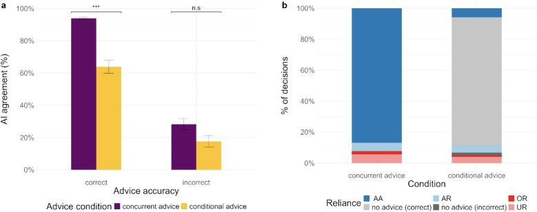

Human–AI teams should ideally perform better than either humans or AI alone. A key obstacle is **overreliance**: people follow AI advice even when it is wrong. In this project led by Eesha Kokje, we tested whether changing **when** AI advice is presented can help – using face matching, a task in which people decide whether two photos show the same person.

#### What we did

In **three preregistered online experiments** (N = 80, 77, and 86), participants judged pairs of unfamiliar faces with the help of an AI system that was correct in 92.5% of cases. We compared the usual *concurrent* presentation (advice shown together with the faces) with three *non-concurrent* alternatives: binary advice **on demand**, similarity ratings **on demand**, and **conditional advice** that was only shown when a participant's initial decision contradicted the AI.

#### What we found

- Overall accuracy did **not differ** between concurrent and non-concurrent advice in any experiment.
- When participants **requested** binary advice, they followed it more – although they requested it on only about a quarter of the trials.
- When they requested **similarity ratings**, they followed the advice less: overreliance decreased, but so did reliance on correct advice. Similarity ratings were not more helpful than simple advice.
- With **conditional advice**, participants followed the AI less often. They were more confident when rejecting incorrect advice, but less confident when accepting correct advice.

<figure class="ak-figure">

<figcaption>(a) Agreement with AI advice by advice accuracy and (b) types of reliance (AA = appropriate acceptance, AR = appropriate rejection, OR = overreliance, UR = underreliance) for concurrent versus conditional advice. Figure 6 from Kokje et al. (2026), <em>Cognitive Research: Principles and Implications</em>, licensed under <a href="https://creativecommons.org/licenses/by/4.0/">CC BY 4.0</a>.</figcaption>
</figure>

#### What this means

Non-concurrent advice can reduce overreliance on AI – but it is no free lunch, because people then also reject more correct advice. The goal should be **calibrated** reliance, which may require combining presentation formats with information about when the AI is likely to be right.

#### Read the paper

Kokje, E., Lermer, E., **Kleine, A.-K.**, & Gaube, S. (2026). AI-augmented decision-making in face matching: Comparing concurrent and non-concurrent advice presentation. *Cognitive Research: Principles and Implications, 11*, 11. [https://doi.org/10.1186/s41235-026-00707-z](https://doi.org/10.1186/s41235-026-00707-z)
