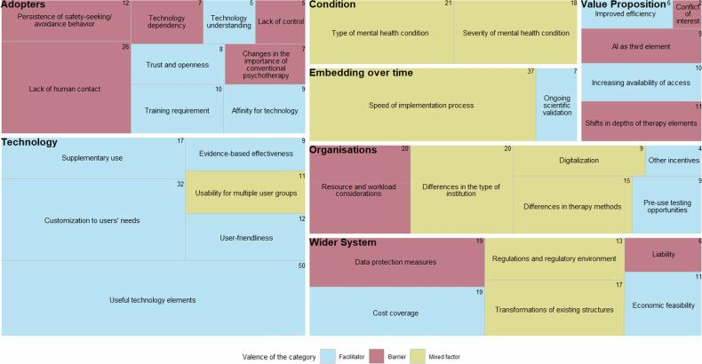

AI technologies could reduce therapists' workload and improve mental healthcare – yet their adoption in psychotherapy remains challenging. In this study led by Julia Cecil (with me as senior author), we asked those who would actually work with these tools: **What would make patients and therapists adopt AI in psychotherapy, and what would hold them back?**

#### What we did

We conducted **six online focus groups** with a total of **32 participants** in Germany – 19 therapists (mostly in training) and 13 patients in psychotherapy for depression or anxiety. The discussion guide was based on the **NASSS framework**, and we analyzed the data with a combined deductive and inductive thematic analysis.

#### What we found

- Across the seven NASSS domains, **36 categories** emerged: **16 facilitators** (e.g., useful technology elements, customization to users' needs, cost coverage), **11 barriers** (e.g., lack of human contact, resource constraints, AI dependency), and **9 factors that could work either way** depending on the context (e.g., the therapeutic approach, institutional differences).
- Nearly half of all statements concerned the technology itself and the people who would use it.
- Patients and therapists raised largely the same topics. Participants saw AI as more suitable for anxiety and depression than for conditions such as psychosis, and as more compatible with structured approaches like CBT than with psychodynamic therapy.

<figure class="ak-figure">

<figcaption>Categories regarding AI adoption in psychotherapy, clustered by NASSS domain (blue = facilitator, red = barrier, yellow = mixed factor; numbers = number of codes). Figure 2 from Cecil et al. (2026), <em>npj Mental Health Research</em>, licensed under <a href="https://creativecommons.org/licenses/by/4.0/">CC BY 4.0</a>.</figcaption>
</figure>

#### What this means

Adopting AI in psychotherapy is complex, and the same factor can help or hinder depending on the setting. Developers should involve patients and therapists early and address barriers – above all, preserving the human relationship at the core of therapy – from the start of development.

#### Read the paper

Cecil, J., Schaffernak, I., Evangelou, D., Lermer, E., Gaube, S., & **Kleine, A.-K.** (2026). Navigating the complexity of AI adoption in psychotherapy by identifying key facilitators and barriers. *npj Mental Health Research, 5*, 17. [https://doi.org/10.1038/s44184-026-00199-1](https://doi.org/10.1038/s44184-026-00199-1)
