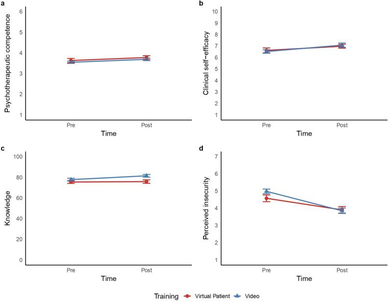

Preparing psychotherapy trainees for the complexity of real clinical encounters is a persistent challenge. **AI-enabled virtual patients** – simulated patients with whom trainees can conduct conversations and receive automated feedback – promise hands-on practice without risks for real patients. In this preregistered study led by Julia Cecil, we tested whether such simulations improve training outcomes.

#### What we did

**87 psychology students and psychotherapy trainees** from Germany and the UK were randomly assigned to either four online sessions with virtual patients (with automated feedback) or four sessions with pre-recorded role-play videos. Each session focused on one disorder – depression, panic disorder, generalized anxiety disorder, or adjustment disorder. Before and after the training, we measured perceived psychotherapeutic competence, clinical self-efficacy, knowledge, and insecurity.

#### What we found

- Virtual patient training **improved perceived competence and self-efficacy** and **reduced insecurity** – but these effects **did not exceed** those of the video training.
- Neither training increased knowledge about mental disorders.
- More clinical experience was associated with higher competence and lower insecurity, but did not change how much participants gained from the training.
- Insecurity decreased earlier with the video training than with the virtual patients.

<figure class="ak-figure">

<figcaption>Mean (a) competence, (b) self-efficacy, (c) knowledge, and (d) insecurity before and after the training. Figure 3 from Cecil et al. (2026), <em>BMC Medical Education</em>, licensed under <a href="https://creativecommons.org/licenses/by/4.0/">CC BY 4.0</a>.</figcaption>
</figure>

#### What this means

AI-enabled virtual patients are a scalable and engaging **complement** to psychotherapy training, not (yet) a superior alternative. Good pre-briefings and more authentic virtual patients could increase their benefits.

#### Read the paper

Cecil, J., Kokje, E., **Kleine, A.-K.**, Schaffernak, I., Vogel, L., Angerer, S., Lermer, E., & Gaube, S. (2026). The effect of AI-enabled virtual patient simulation on training outcomes and insecurities in psychotherapy education. *BMC Medical Education, 26*, 1156. [https://doi.org/10.1186/s12909-026-09917-x](https://doi.org/10.1186/s12909-026-09917-x)
