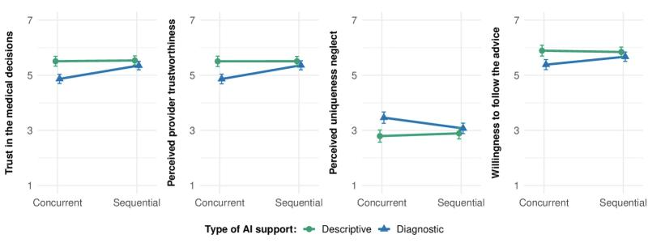

More and more physicians make decisions together with AI-based clinical decision support. But how do **patients** feel about such hybrid decisions? In this project led by Insa Schaffernak, we examined whether the **type** of AI support and its **timing** in the decision process affect patients' trust.

#### What we did

In **two preregistered vignette experiments**, 489 and 570 participants from Germany imagined four eye-care consultations, co-developed with ophthalmologists. The physician used no AI, **descriptive AI** (which highlights features in retinal images), or **diagnostic AI** (which additionally suggests a preliminary diagnosis). Study 2 also varied whether the physician looked at the AI output **after an independent own assessment** (sequential) or **at the same time** as the medical information (concurrent). We also analyzed more than 2,600 open-ended responses.

#### What we found

- Diagnostic AI support led to **lower trust** in the medical decision and in the physician, and to a stronger feeling that the patient's individual situation was neglected, compared with descriptive AI support. Participants' willingness to follow the advice did not differ.
- Study 2 replicated these results – and showed that **timing matters**: the disadvantage of diagnostic AI disappeared when the physician first assessed the case independently before consulting the AI.
- In their open answers, participants worried that erroneous AI output could bias physicians and wished for AI as an independent **second opinion**.

<figure class="ak-figure">

<figcaption>Effects of the type (descriptive vs. diagnostic) and timing (concurrent vs. sequential) of AI support on trust in the decision, perceived trustworthiness, uniqueness neglect, and willingness to follow the advice. Figure 5 from Schaffernak et al. (2026), <em>Journal of Medical Internet Research</em>, licensed under <a href="https://creativecommons.org/licenses/by/4.0/">CC BY 4.0</a>.</figcaption>
</figure>

#### What this means

Patients accept AI support more readily when it is used for analysis rather than for decisions – or when physicians visibly retain their independence. How AI is integrated into the consultation can therefore matter as much as whether it is used at all.

#### Read the paper

Schaffernak, I., Cecil, J., Kokje, E., **Kleine, A.-K.**, Saad, A., Zemo, F., & Lermer, E. (2026). Effects of type and timing of clinician-facing AI support on patient trust in medical consultations: 2 vignette experiments. *Journal of Medical Internet Research, 28*, e93172. [https://doi.org/10.2196/93172](https://doi.org/10.2196/93172)
