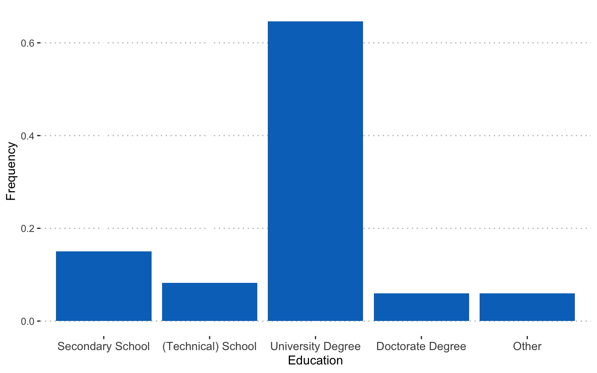

<script src="index_files/libs/htmlwidgets-1.5.4/htmlwidgets.js"></script>
<link href="index_files/libs/datatables-css-0.0.0/datatables-crosstalk.css" rel="stylesheet" />
<script src="index_files/libs/datatables-binding-0.23/datatables.js"></script>
<script src="index_files/libs/jquery-3.6.0/jquery-3.6.0.min.js"></script>
<link href="index_files/libs/dt-core-1.11.3/css/jquery.dataTables.min.css" rel="stylesheet" />
<link href="index_files/libs/dt-core-1.11.3/css/jquery.dataTables.extra.css" rel="stylesheet" />
<script src="index_files/libs/dt-core-1.11.3/js/jquery.dataTables.min.js"></script>
<script src="index_files/libs/jszip-1.11.3/jszip.min.js"></script>
<link href="index_files/libs/dt-ext-buttons-1.11.3/css/buttons.dataTables.min.css" rel="stylesheet" />
<script src="index_files/libs/dt-ext-buttons-1.11.3/js/dataTables.buttons.min.js"></script>
<script src="index_files/libs/dt-ext-buttons-1.11.3/js/buttons.html5.min.js"></script>
<script src="index_files/libs/dt-ext-buttons-1.11.3/js/buttons.colVis.min.js"></script>
<script src="index_files/libs/dt-ext-buttons-1.11.3/js/buttons.print.min.js"></script>
<link href="index_files/libs/crosstalk-1.2.0/css/crosstalk.min.css" rel="stylesheet" />
<script src="index_files/libs/crosstalk-1.2.0/js/crosstalk.min.js"></script>


I used natural language processing (NLP) to analyse texts entrepreneurs wrote about the errors that happened in their business over the past two weeks. Entrepreneurs in the sample were from India and the Netherlands, operating in various industries.

## Data preparation

### Loading standard libraries and source custom functions

``` r
library(kableExtra)
library(tidyverse)
library(expss)
library(lattice)

source("R/custom_functions.R")
```

### Reading in data and preprocessing

I prepared the data for reliability assessment and correlation analysis.

``` r
dat <- read_csv("data/dat.csv")

evdes <- dat$t1evdes_
comp_dat <- dat %>%
  dplyr::select(matches("t1emotions|jobstr|jobsa|t1threat|gender|age|found|t1occ$|lang|edu|max_sev"))

alph_dat <- dat %>%
  dplyr::select(matches("t1emotions|jobstr|t1threat"))

comp_split <- comp_dat %>%
  split.default(sub("_.*", "", names(comp_dat))) 

alph_split <- alph_dat %>%
  split.default(sub("_.*", "", names(alph_dat))) 


comp <- map(comp_split, ~ multicon::composite(.x, nomiss = 0.8), data = .x) %>% as.data.frame(.)
alph <- map(alph_split, ~ psych::alpha(.x, check.keys=TRUE), data = .x) %>%
  map(~ .x$total)

alph_df <- do.call("rbind", alph) %>% round(., 2)
```

### Overview of sample characteristics

#### Age of the entrepreneurs in the sample:


#### Educational level:



#### Gender:


#### Language:


#### Current occupation:


#### Whether they were involved in founding the business:


### Reliabilities for multi-item variables:

``` r
alph_df %>%
DT::datatable(
    extensions = 'Buttons', 
    options = list(dom = 'Bfrtip', 
                   buttons = c('excel', "csv"),
                   pageLength = 20))
```

<div id="htmlwidget-08bce9348eae4bfe9973" style="width:100%;height:auto;" class="datatables html-widget"></div>
<script type="application/json" data-for="htmlwidget-08bce9348eae4bfe9973">{"x":{"filter":"none","vertical":false,"extensions":["Buttons"],"data":[["t1emotions","t1jobstr","t1threat","t2jobstr","t3jobstr"],[0.87,0.82,0.83,0.86,0.85],[0.87,0.83,0.83,0.88,0.83],[0.89,0.82,0.78,0.9,0.9],[0.3,0.44,0.62,0.55,0.5],[6.48,4.74,4.95,7.45,5],[0.02,0.02,0.03,0.02,0.02],[2.32,1.79,2.84,1.87,2.02],[0.75,0.66,1.22,0.72,0.65],[0.31,0.45,0.59,0.57,0.55]],"container":"<table class=\"display\">\n  <thead>\n    <tr>\n      <th> <\/th>\n      <th>raw_alpha<\/th>\n      <th>std.alpha<\/th>\n      <th>G6(smc)<\/th>\n      <th>average_r<\/th>\n      <th>S/N<\/th>\n      <th>ase<\/th>\n      <th>mean<\/th>\n      <th>sd<\/th>\n      <th>median_r<\/th>\n    <\/tr>\n  <\/thead>\n<\/table>","options":{"dom":"Bfrtip","buttons":["excel","csv"],"pageLength":20,"columnDefs":[{"className":"dt-right","targets":[1,2,3,4,5,6,7,8,9]},{"orderable":false,"targets":0}],"order":[],"autoWidth":false,"orderClasses":false,"lengthMenu":[10,20,25,50,100]}},"evals":[],"jsHooks":[]}</script>

### Correlation table:

``` r
cor <- round(cor(comp, use="pairwise.complete.obs"), 2)

corstar_select <- data.frame(corstars(comp, removeTriangle = "none", result="none"))

corstar_select %>%
  DT::datatable(
    extensions = 'Buttons', 
    options = list(dom = 'Bfrtip', 
                   buttons = c('excel', "csv"),
                   pageLength = 10,
                   lengthMenu = c(25, 50, 75, 94)))
```

<div id="htmlwidget-c27191f738c4dac1c7fa" style="width:100%;height:auto;" class="datatables html-widget"></div>
<script type="application/json" data-for="htmlwidget-c27191f738c4dac1c7fa">{"x":{"filter":"none","vertical":false,"extensions":["Buttons"],"data":[["t1age","t1edu","t1emotions","t1found","t1gender","t1jobsa","t1jobstr","t1lang","t1occ","t1threat","t2jobsa","t2jobstr","t3jobsa","t3jobstr"],[" 1.00 "," 0.22**  ","-0.07    ","-0.11    ","-0.07    "," 0.06    ","-0.04    "," 0.04    ","-0.25**  ","-0.02    "," 0.19    ","-0.30    "," 0.04    ","-0.02    "],[" 0.22**  "," 1.00 ","-0.06    ","-0.17    ","-0.14    "," 0.10    ","-0.16    "," 0.12    ","-0.19*   ","-0.04    "," 0.14    ","-0.27    ","-0.41    "," 0.12    "],["-0.07    ","-0.06    "," 1.00 "," 0.14    ","-0.14    ","-0.35*** "," 0.62*** "," 0.04    "," 0.03    "," 0.36*** ","-0.54*   "," 0.72*** ","-0.14    "," 0.27    "],["-0.11    ","-0.17    "," 0.14    "," 1.00 "," 0.12    ","-0.06    "," 0.06    "," 0.01    "," 0.03    "," 0.01    ","  NaNNA","  NaNNA","-0.01    ","-0.28    "],["-0.07    ","-0.14    ","-0.14    "," 0.12    "," 1.00 "," 0.15    ","-0.05    ","-0.03    "," 0.24**  ","-0.09    "," 0.32    ","-0.34    "," 0.21    ","-0.27    "],[" 0.06    "," 0.10    ","-0.35*** ","-0.06    "," 0.15    "," 1.00 ","-0.56*** ","-0.05    "," 0.08    ","-0.10    "," 0.90*** ","-0.76*** "," 0.78*   "," 0.21    "],["-0.04    ","-0.16    "," 0.62*** "," 0.06    ","-0.05    ","-0.56*** "," 1.00 ","-0.02    ","-0.01    "," 0.23**  ","-0.68*** "," 0.72*** ","-0.22    "," 0.41    "],[" 0.04    "," 0.12    "," 0.04    "," 0.01    ","-0.03    ","-0.05    ","-0.02    "," 1.00 "," 0.01    "," 0.08    ","-0.17    "," 0.40    ","-0.09    "," 0.52    "],["-0.25**  ","-0.19*   "," 0.03    "," 0.03    "," 0.24**  "," 0.08    ","-0.01    "," 0.01    "," 1.00 "," 0.05    "," 0.26    "," 0.10    "," 0.36    "," 0.74*   "],["-0.02    ","-0.04    "," 0.36*** "," 0.01    ","-0.09    ","-0.10    "," 0.23**  "," 0.08    "," 0.05    "," 1.00 ","-0.08    "," 0.10    "," 0.24    "," 0.09    "],[" 0.19    "," 0.14    ","-0.54*   ","  NaNNA"," 0.32    "," 0.90*** ","-0.68*** ","-0.17    "," 0.26    ","-0.08    "," 1.00 ","-0.70*** "," 0.99    "," 0.28    "],["-0.30    ","-0.27    "," 0.72*** ","  NaNNA","-0.34    ","-0.76*** "," 0.72*** "," 0.40    "," 0.10    "," 0.10    ","-0.70*** "," 1.00 ","-0.28    "," 0.76    "],[" 0.04    ","-0.41    ","-0.14    ","-0.01    "," 0.21    "," 0.78*   ","-0.22    ","-0.09    "," 0.36    "," 0.24    "," 0.99    ","-0.28    "," 1.00 "," 0.39    "]],"container":"<table class=\"display\">\n  <thead>\n    <tr>\n      <th> <\/th>\n      <th>t1age<\/th>\n      <th>t1edu<\/th>\n      <th>t1emotions<\/th>\n      <th>t1found<\/th>\n      <th>t1gender<\/th>\n      <th>t1jobsa<\/th>\n      <th>t1jobstr<\/th>\n      <th>t1lang<\/th>\n      <th>t1occ<\/th>\n      <th>t1threat<\/th>\n      <th>t2jobsa<\/th>\n      <th>t2jobstr<\/th>\n      <th>t3jobsa<\/th>\n    <\/tr>\n  <\/thead>\n<\/table>","options":{"dom":"Bfrtip","buttons":["excel","csv"],"pageLength":10,"lengthMenu":[25,50,75,94],"columnDefs":[{"orderable":false,"targets":0}],"order":[],"autoWidth":false,"orderClasses":false}},"evals":[],"jsHooks":[]}</script>

## Text mining

First, I created an annotated data frame from the text data.

``` r
library(udpipe)
ud_model <- udpipe_download_model(language = "english")
ud_model <- udpipe_load_model(ud_model$file_model)
x <- udpipe_annotate(ud_model, x = evdes)
x <- as.data.frame(x)
```

Next, I selected nouns and adjectives from the text data frame and removed duplicate entries.

``` r
library(tm)
stats <- subset(x, upos %in% c("NOUN", "ADJ"))

stats2 <- stats %>% 
     dplyr::group_by(doc_id) %>% 
     dplyr::mutate(sentences = paste0(token, collapse = " ")) 

evdes_nouns <- stats2[!(duplicated(stats2$sentences) | duplicated(stats2$sentences)),] %>% dplyr::select(sentences)

evdes <- evdes_nouns$sentences
evdes_1 <- VectorSource(evdes)
TextDoc <- Corpus(evdes_1)
```

### Cleaning text data

I cleaned the data by removing unnecessary white space and converting special characters into white space. I also transformed all letters to lower case, removed numbers, stop words (e.g., and, or...), and punctuation. Finally, I lemmatized the remaining words (see [here](https://www.rdocumentation.org/packages/textstem/versions/0.1.4/topics/lemmatize_strings) for more information on the lemmatization function.)

``` r
library(textstem)
#Replacing "/", "@" and "|" with space
toSpace <- content_transformer(function(x, pattern ) gsub(pattern, " ", x))
TextDoc <- tm_map(TextDoc, toSpace, "/")
TextDoc <- tm_map(TextDoc, toSpace, "@")
TextDoc <- tm_map(TextDoc, toSpace, "\\|")
TextDoc <- tm_map(TextDoc, toSpace, "\\|")

# Convert the text to lower case
TextDoc <- tm_map(TextDoc, content_transformer(tolower))
# Remove numbers
TextDoc <- tm_map(TextDoc, removeNumbers)
# Remove english common stopwords
TextDoc <- tm_map(TextDoc, removeWords, stopwords("english"))
# Remove punctuations
TextDoc <- tm_map(TextDoc, removePunctuation)
# Eliminate extra white spaces
TextDoc <- tm_map(TextDoc, stripWhitespace)
# Text stemming - which reduces words to their root form
#TextDoc <- tm_map(TextDoc, stemDocument)
TextDoc <- tm_map(TextDoc, lemmatize_strings)
```

### Building the document martix

``` r
# Build a term-document matrix
TextDoc_tdm <- TermDocumentMatrix(TextDoc)
TextDoc_dtm <- DocumentTermMatrix(TextDoc)
TextDoc_tdm <- removeSparseTerms(TextDoc_tdm, .99)
TextDoc_dtm <- removeSparseTerms(TextDoc_dtm, .99)

dtm_m <- as.matrix(TextDoc_tdm)
# Sort by descearing value of frequency
dtm_v <- sort(rowSums(dtm_m),decreasing=TRUE)
dtm_d <- data.frame(word = names(dtm_v),freq=dtm_v)
# Display the top 5 most frequent words
head(dtm_d, 5)
```

                 word freq
    product   product   22
    client     client   21
    business business   16
    time         time   16
    customer customer   12

### A word cloud of the most common nouns and adjectives

``` r
library(wordcloud)
#generate word cloud
set.seed(1234)
wordcloud(words = dtm_d$word, freq = dtm_d$freq, min.freq = 5,
          scale=c(3,.4), 
          max.words=100, random.order=FALSE, rot.per=0.40, 
          colors=brewer.pal(8, "Dark2"))
```


### The most frequently occurring nouns and adjectives

``` r
stats <- subset(x, upos %in% c("NOUN", "ADJ"))
stats <- txt_freq(x = stats$lemma)

dtm_d$word <- factor(dtm_d$word, levels = rev(dtm_d$word))
dtm_head <- head(dtm_d, 22)
barchart(word ~ freq, data = dtm_head, col = "cadetblue", main = "Most occurring nouns and adjectives", xlab = "Freq")
```


### Showing connections between words

I created a cluster dendogram to show connections between words.

``` r
library(tidytext)

dtm_top <- removeSparseTerms(TextDoc_tdm, sparse = .97)
TextDoc_tdm_m <- as.matrix(dtm_top)
distance <- dist(TextDoc_tdm_m, method = "euclidean")
fit <- hclust(distance, method = "complete")
plot(fit)
```


Hmm.. not super informative. What about trying to find topics in the texts?

### Topic modeling

#### I started with 10 topics...

``` r
library(topicmodels)
rowTotals <- apply(TextDoc_dtm , 1, sum)
TextDoc_dtm   <- TextDoc_dtm[rowTotals> 0, ] 
# set a seed so that the output of the model is predictable
ap_lda <- LDA(TextDoc_dtm, k = 10, control = list(seed = 1234))
ap_lda
```

    A LDA_VEM topic model with 10 topics.

``` r
#> A LDA_VEM topic model with 2 topics.

ap_topics <- tidy(ap_lda, matrix = "beta")

ap_top_terms <- ap_topics %>%
  group_by(topic) %>%
  slice_max(beta, n = 4) %>% 
  ungroup() %>%
  arrange(topic, -beta)

ap_top_terms %>%
  mutate(term = reorder_within(term, beta, topic)) %>%
  ggplot(aes(beta, term, fill = factor(topic))) +
  geom_col(show.legend = FALSE) +
  facet_wrap(~ topic, scales = "free") +
  scale_y_reordered()
```


The visualisation displays the per-topic-per-word probabilities (called beta). For each word combination, the model computes the probability of that term being generated from that topic. For example, the most common words in topic 1 include "part", "lack", and "fund". Maybe sth. related to capital and funding? Topic five revolves around issues with customers and service. The usefulness of the topic modeling always depends on the text data. And finding the right number of topics to extract is an iterative approach.

#### Here's a solution for 6 topics:

``` r
# set a seed so that the output of the model is predictable
ap_lda <- LDA(TextDoc_dtm, k = 6, control = list(seed = 1234))
#> A LDA_VEM topic model with 2 topics.

ap_topics <- tidy(ap_lda, matrix = "beta")

ap_top_terms <- ap_topics %>%
  group_by(topic) %>%
  slice_max(beta, n = 5) %>% 
  ungroup() %>%
  arrange(topic, -beta)

ap_top_terms %>%
  mutate(term = reorder_within(term, beta, topic)) %>%
  ggplot(aes(beta, term, fill = factor(topic))) +
  geom_col(show.legend = FALSE) +
  facet_wrap(~ topic, scales = "free") +
  scale_y_reordered()
```


See [here](https://www.tidytextmining.com/topicmodeling.html) for more information on topic modeling.

We could also consider examining the words with the greatest difference in beta between two topics. This can be estimated based on the log ratio of the two. We can filter for relatively common words to make the example more concrete. Here, we filter for words with a beta greater than 0.001.

``` r
library(tidyr)
beta_wide <- ap_topics %>%
  mutate(topic = paste0("topic", topic)) %>%
  pivot_wider(names_from = topic, values_from = beta) %>% 
  filter(topic1 > .001 | topic2 > .001) %>%
  mutate(log_ratio = log2(topic2 / topic1))

beta_wide
```

    # A tibble: 59 × 8
       term        topic1   topic2   topic3   topic4   topic5   topic6 log_ratio
       <chr>        <dbl>    <dbl>    <dbl>    <dbl>    <dbl>    <dbl>     <dbl>
     1 financial 1.24e- 2 9.01e-60 2.00e- 2 7.09e-23 1.12e-13 4.47e-43  -190.   
     2 month     7.43e- 2 2.18e-29 1.92e-48 1.20e-78 1.14e-58 2.59e-45   -91.5  
     3 revenue   2.27e- 2 4.89e-69 1.78e-75 2.45e-63 1.29e- 2 3.24e-74  -221.   
     4 support   3.72e- 2 6.41e-25 3.27e-68 1.18e-21 3.88e-31 4.42e-25   -75.6  
     5 time      2.58e- 2 3.43e- 2 4.79e-14 1.23e- 1 8.13e-23 2.26e- 3     0.408
     6 unable    2.48e- 2 6.61e-18 3.88e-28 4.38e-52 5.72e-10 1.53e-61   -51.7  
     7 company   4.81e-47 6.45e- 2 2.68e-42 3.58e-39 1.13e-71 2.67e-35   150.   
     8 contact   4.77e-69 2.58e- 2 1.33e-74 1.39e-71 3.81e-30 4.05e-71   222.   
     9 day       5.11e-59 5.02e- 2 1.01e- 2 4.96e-14 6.97e-36 1.15e- 3   189.   
    10 job       9.47e-69 5.16e- 2 3.06e-75 5.72e-71 2.03e-74 6.21e-25   222.   
    # … with 49 more rows

``` r
beta_wide %>%
  group_by(direction = log_ratio > 0) %>%
  slice_max(abs(log_ratio), n = 10) %>% 
  ungroup() %>%
  mutate(term = reorder(term, log_ratio)) %>%
  ggplot(aes(log_ratio, term)) +
  geom_col() +
  labs(x = "Log2 ratio of beta in topic 2 / topic 1", y = NULL)
```


