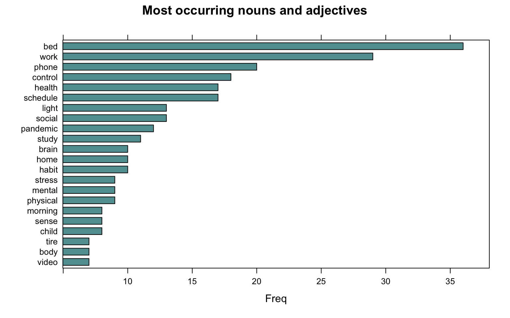
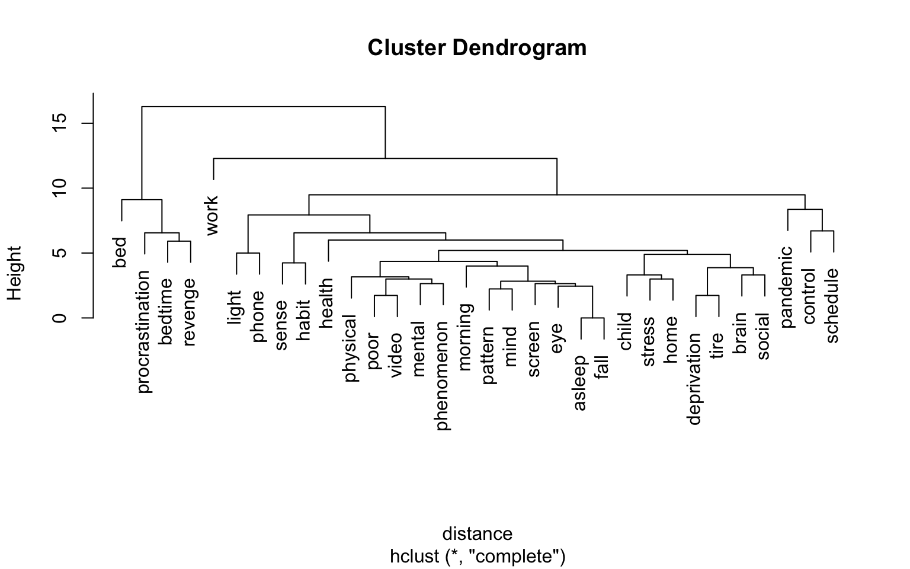
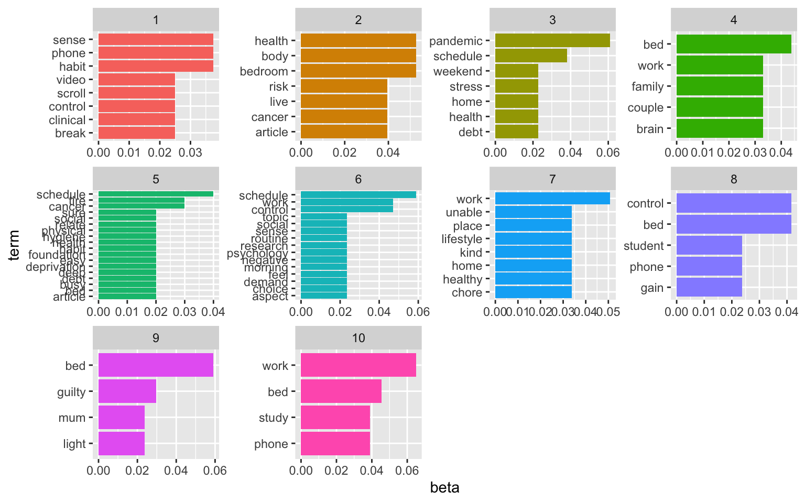
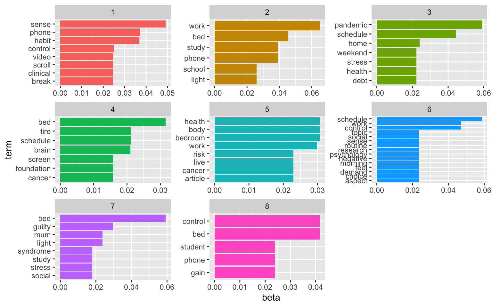
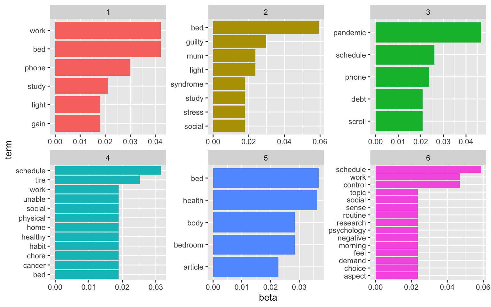
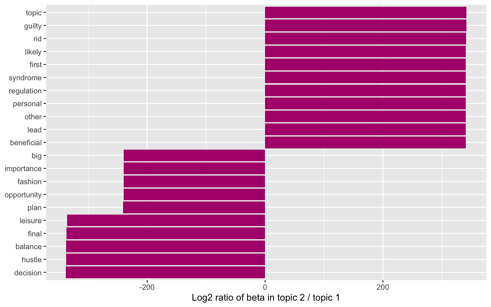
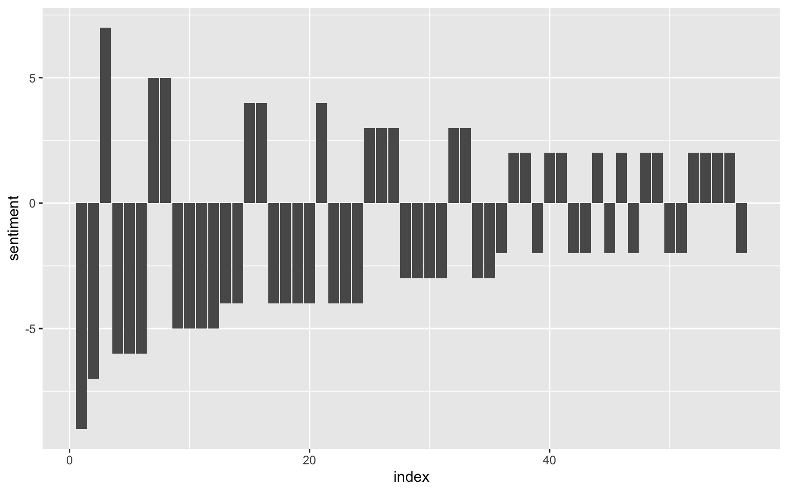
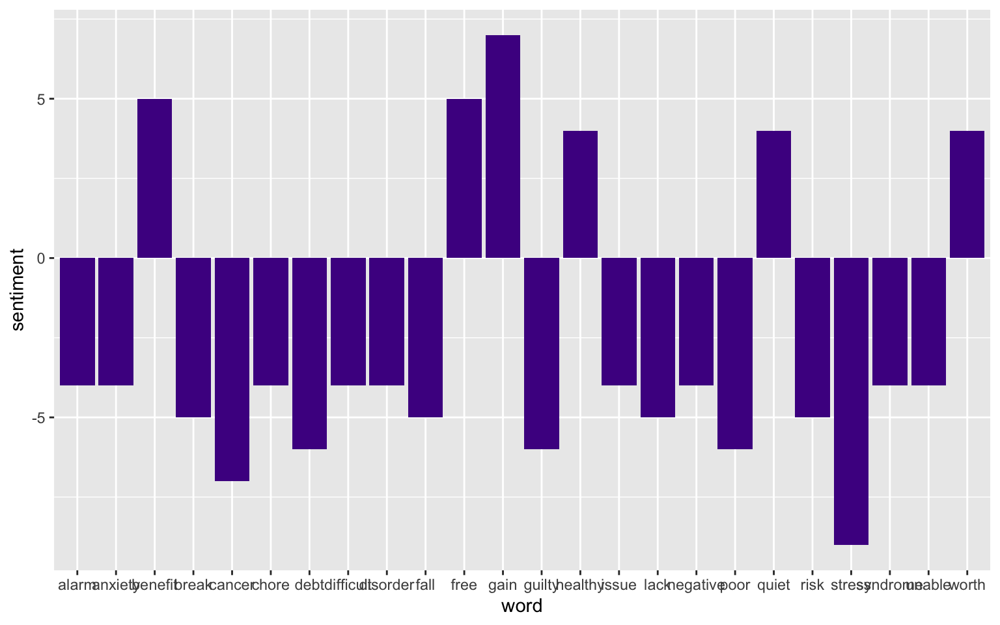

We used natural language processing (NLP) tools in R to analyse newspaper articles about revenge bedtime procrastination. We preselected articles that contain the keyword **revenge bedtime procrastination** in the title.

## Data preparation

### Loading standard libraries and source custom functions

``` r
library(kableExtra)
library(tidyverse)
library(expss)
library(lattice)

source("R/custom_functions.R")
```

### Reading in data and preprocessing

``` r
dat <- readxl::read_excel("data/newsdata_selected.xlsx")

content <- dat$Content
```

## Text mining

First, we created an annotated data frame from the text data.

``` r
library(udpipe)
ud_model <- udpipe_download_model(language = "english")
```

The Universal Dependencies (UD) models contain 94 models of 61 languages, each consisting of a tokenizer, tagger, lemmatizer and dependency parser, all trained using the UD data. See [here](https://ufal.mff.cuni.cz/udpipe/1/models) for more information. We downloaded the English language Universal Dependencies (UD) model to use it for our text data.

``` r
ud_model <- udpipe_load_model(ud_model$file_model)
x <- udpipe_annotate(ud_model, x = content)
x <- as.data.frame(x)
```

Next, we selected nouns and adjectives from the text data frame and removed duplicate entries.

``` r
library(tm)
stats <- subset(x, upos %in% c("NOUN", "ADJ"))

stats2 <- stats %>% 
     dplyr::group_by(doc_id) %>% 
     dplyr::mutate(sentences = paste0(token, collapse = " ")) 

text_nouns <- stats2[!(duplicated(stats2$sentences) | duplicated(stats2$sentences)),] %>% dplyr::select(sentences)

evdes <- text_nouns$sentences
evdes_1 <- VectorSource(evdes)
TextDoc <- Corpus(evdes_1)
```

### Cleaning text data

Next, we cleaned the text data. Specifically, we removed unnecessary white space and converted special characters into white space. We also transformed letters to lower case, removed numbers, stop words (e.g., and, or...), and punctuation. Finally, used lemmatization for remaining words (see [here](https://www.rdocumentation.org/packages/textstem/versions/0.1.4/topics/lemmatize_strings) for more information on lemmatization.)

``` r
library(textstem)
#Replacing "/", "@" and "|" with space
toSpace <- content_transformer(function(x, pattern ) gsub(pattern, " ", x))
TextDoc <- tm_map(TextDoc, toSpace, "/")
TextDoc <- tm_map(TextDoc, toSpace, "@")
TextDoc <- tm_map(TextDoc, toSpace, "\\|")
TextDoc <- tm_map(TextDoc, toSpace, "\\|")

# Convert the text to lower case
TextDoc <- tm_map(TextDoc, content_transformer(tolower))
# Remove numbers
TextDoc <- tm_map(TextDoc, removeNumbers)
# Remove english common stopwords
TextDoc <- tm_map(TextDoc, removeWords, stopwords("english"))
# Remove punctuations
TextDoc <- tm_map(TextDoc, removePunctuation)
# Eliminate extra white spaces
TextDoc <- tm_map(TextDoc, stripWhitespace)
# Text stemming - which reduces words to their root form
#TextDoc <- tm_map(TextDoc, stemDocument)
TextDoc <- tm_map(TextDoc, lemmatize_strings)
```

We also removed a couple of words that are not very informative for understanding the phenomenon, including words relating to time or abstract words like "thing", "many", "medium", ...

``` r
TextDoc <- tm_map(TextDoc, removeWords, c("sleep", "day", "time", "hour", "night","long", "late", "year", "minute", "week", "daytime",
                                          "people", "thing", "term", "way", "reason", "expert", "effect", "part", "life", "activity", "person",
                                          "self", "consequence", "read", "amount", "problem", "behaviour", "behavior", "concept",
                                          "many", "medium", "important", "much", "enough", "next", "enough", "important", "good",
                                          "little", "right", "high", "hard", "new", "even", "bad", "close"))
```

Additionally, we create a text document with our keywords ("revenge", "bedtime", "procrastination") removed.

``` r
TextDoc_wc <- tm_map(TextDoc, removeWords, c("revenge", "bedtime", "sleep", "procrastination", "day"))
```

We also removed words that appear in less than 90 percent of all documents.

``` r
# Build a term-document matrix
TextDoc_tdm <- TermDocumentMatrix(TextDoc)
TextDoc_dtm <- DocumentTermMatrix(TextDoc)
TextDoc_tdm <- removeSparseTerms(TextDoc_tdm, .90)
TextDoc_dtm <- removeSparseTerms(TextDoc_dtm, .90)

TextDoc_tdm_wc <- TermDocumentMatrix(TextDoc_wc)
TextDoc_dtm_wc <- DocumentTermMatrix(TextDoc_wc)
TextDoc_tdm_wc <- removeSparseTerms(TextDoc_tdm_wc, .90)
TextDoc_dtm_wc <- removeSparseTerms(TextDoc_dtm_wc, .90)
```

We sorted the results by the number the terms appear in the texts (decreasing).

``` r
dtm_m <- as.matrix(TextDoc_tdm)
# Sort by descearing value of frequency
dtm_v <- sort(rowSums(dtm_m),decreasing=TRUE)
dtm_d <- data.frame(word = names(dtm_v),freq=dtm_v)
# Display the top 5 most frequent words

dtm_m_wc <- as.matrix(TextDoc_tdm_wc)
# Sort by descearing value of frequency
dtm_v_wc <- sort(rowSums(dtm_m_wc),decreasing=TRUE)
dtm_d_wc <- data.frame(word = names(dtm_v_wc),freq=dtm_v_wc)
# Display the top 5 most frequent words
#
```

As was to be expected, the most frequently appearing words in the original documents are our keywords.

``` r
head(dtm_d, 5)
```

                               word freq
    procrastination procrastination   47
    bedtime                 bedtime   44
    bed                         bed   36
    revenge                 revenge   33
    work                       work   29

But if the keywords are removed, the ten most frequent words are:

``` r
head(dtm_d_wc, 10)
```

                 word freq
    bed           bed   36
    work         work   29
    phone       phone   20
    control   control   18
    health     health   17
    schedule schedule   17
    light       light   13
    social     social   13
    pandemic pandemic   12
    study       study   11

### A word cloud of the most common nouns and adjectives

``` r
library(wordcloud)
#generate word cloud
set.seed(1234)
wordcloud(words = dtm_d_wc$word, freq = dtm_d$freq, min.freq = 5,
          scale=c(3,.4), 
          max.words=100, random.order=FALSE, rot.per=0.40, 
          colors=brewer.pal(8, "Dark2"))
```


### The most frequently occurring nouns and adjectives

``` r
stats <- subset(x, upos %in% c("NOUN", "ADJ"))
stats <- txt_freq(x = stats$lemma)

dtm_d_wc$word <- factor(dtm_d_wc$word, levels = rev(dtm_d_wc$word))
dtm_head <- head(dtm_d_wc, 22)
barchart(word ~ freq, data = dtm_head, col = "cadetblue", main = "Most occurring nouns and adjectives", xlab = "Freq")
```



### Showing connections between words

We created a cluster dendogram to show connections between words, with a sparsity threshold of 60 percent.

``` r
library(tidytext)

dtm_top <- removeSparseTerms(TextDoc_tdm, sparse = .60)
TextDoc_tdm_m <- as.matrix(dtm_top)
distance <- dist(TextDoc_tdm_m, method = "euclidean")
fit <- hclust(distance, method = "complete")
plot(fit)
```



### Topic modeling

#### We started with 10 topics

We again selected the text matrix without the keywords ("revenge", "bedtime", and "procrastination")

``` r
library(topicmodels)
rowTotals <- apply(TextDoc_dtm_wc , 1, sum)
TextDoc_dtm   <- TextDoc_dtm_wc[rowTotals> 3, ] 
# set a seed so that the output of the model is predictable
ap_lda <- LDA(TextDoc_dtm, k = 10, control = list(seed = 1234))
ap_lda
```

    A LDA_VEM topic model with 10 topics.

``` r
#> A LDA_VEM topic model with 2 topics.

ap_topics <- tidy(ap_lda, matrix = "beta")

ap_top_terms <- ap_topics %>%
  group_by(topic) %>%
  slice_max(beta, n = 4) %>% 
  ungroup() %>%
  arrange(topic, -beta)

ap_top_terms %>%
  mutate(term = reorder_within(term, beta, topic)) %>%
  ggplot(aes(beta, term, fill = factor(topic))) +
  geom_col(show.legend = FALSE) +
  facet_wrap(~ topic, scales = "free") +
  scale_y_reordered()
```



The visualisation displays the per-topic-per-word probabilities (called beta). For each word combination, the model computes the probability of that term being generated from that topic. For example, the most common words in topic 1 include "part", "lack", and "fund". Maybe sth. related to capital and funding? Topic five revolves around issues with customers and service. The usefulness of the topic modeling always depends on the text data. And finding the right number of topics to extract is an iterative approach.

#### Here's a solution for 8 topics:

``` r
# set a seed so that the output of the model is predictable
ap_lda <- LDA(TextDoc_dtm, k = 8, control = list(seed = 1234))
#> A LDA_VEM topic model with 2 topics.

ap_topics <- tidy(ap_lda, matrix = "beta")

ap_top_terms <- ap_topics %>%
  group_by(topic) %>%
  slice_max(beta, n = 5) %>% 
  ungroup() %>%
  arrange(topic, -beta)

ap_top_terms %>%
  mutate(term = reorder_within(term, beta, topic)) %>%
  ggplot(aes(beta, term, fill = factor(topic))) +
  geom_col(show.legend = FALSE) +
  facet_wrap(~ topic, scales = "free") +
  scale_y_reordered()
```



#### Here's a solution for 6 topics:

``` r
# set a seed so that the output of the model is predictable
ap_lda <- LDA(TextDoc_dtm, k = 6, control = list(seed = 1234))
#> A LDA_VEM topic model with 2 topics.

ap_topics <- tidy(ap_lda, matrix = "beta")

ap_top_terms <- ap_topics %>%
  group_by(topic) %>%
  slice_max(beta, n = 5) %>% 
  ungroup() %>%
  arrange(topic, -beta)

ap_top_terms %>%
  mutate(term = reorder_within(term, beta, topic)) %>%
  ggplot(aes(beta, term, fill = factor(topic))) +
  geom_col(show.legend = FALSE) +
  facet_wrap(~ topic, scales = "free") +
  scale_y_reordered()
```



See [here](https://www.tidytextmining.com/topicmodeling.html) for more information on topic modeling.

We could also consider examining the words with the greatest difference in beta between two topics. This can be estimated based on the log ratio of the two. We can filter for relatively common words to make the example more concrete. Here, we filter for words with a beta greater than 0.005.

``` r
library(tidyr)
beta_wide <- ap_topics %>%
  mutate(topic = paste0("topic", topic)) %>%
  pivot_wider(names_from = topic, values_from = beta) %>% 
  filter(topic1 > .005 | topic2 > .005) %>%
  mutate(log_ratio = log2(topic2 / topic1))

beta_wide
```

    # A tibble: 167 × 8
       term     topic1    topic2    topic3    topic4    topic5   topic6 log_ratio
       <chr>     <dbl>     <dbl>     <dbl>     <dbl>     <dbl>    <dbl>     <dbl>
     1 alarm   0.00904 6.55e- 75 5.20e-  3 8.16e-242 4.63e-104 1.31e-74 -240.    
     2 balance 0.00904 2.67e-104 2.07e-104 2.80e-248 2.46e-104 9.48e-75 -337.    
     3 bed     0.0422  5.92e-  2 1.32e-  2 1.89e-  2 3.67e-  2 2.47e-74    0.489 
     4 binge   0.00602 9.51e- 75 8.36e- 75 6.29e-  3 5.69e-  3 1.89e-74 -239.    
     5 brain   0.0120  1.18e-  2 2.38e-  7 6.29e-  3 1.14e-  2 1.18e- 2   -0.0258
     6 busy    0.00602 3.72e- 44 5.13e-  3 1.26e-  2 8.49e-  5 1.95e-74 -137.    
     7 chinese 0.00904 3.72e- 44 2.59e-104 1.52e-247 3.07e-104 1.18e- 2 -137.    
     8 clock   0.00602 5.92e-  3 1.04e-  2 1.43e-243 6.53e- 75 1.35e-74   -0.0258
     9 concern 0.00301 5.92e-  3 3.15e-104 5.91e-240 5.66e- 75 1.17e-74    0.974 
    10 control 0.0151  5.92e-  3 1.82e-  2 6.29e-  3 1.99e-  2 4.71e- 2   -1.35  
    # … with 157 more rows

``` r
beta_wide %>%
  group_by(direction = log_ratio > 0) %>%
  slice_max(abs(log_ratio), n = 10) %>% 
  ungroup() %>%
  mutate(term = reorder(term, log_ratio)) %>%
  ggplot(aes(log_ratio, term)) +
  geom_col(fill = "#b0157a") +
  labs(x = "Log2 ratio of beta in topic 2 / topic 1", y = NULL)
```



### Sentiment analysis

Sentiment Analysis is a process of extracting opinions that have different scores like positive, negative or neutral. Based on sentiment analysis, we can find out the nature of opinion or sentences in the newspaper articles.

``` r
library(tidytext)
library(textdata)

nrc_joy <- get_sentiments("nrc") %>% 
  filter(sentiment == "joy")

joyful_aspects <- dtm_d_wc %>%
  inner_join(nrc_joy) %>%
  count(word, sort = TRUE)
```

A wordcloud of the joyful and pleasant aspects of revenge bedtime procrastination.

``` r
library(wordcloud)
#generate word cloud
set.seed(1234)
wordcloud(words = joyful_aspects$word, freq = dtm_d$freq, min.freq = 5,
          scale=c(3,.4), 
          max.words=100, random.order=FALSE, rot.per=0.40, 
          colors=brewer.pal(8, "Dark2"))
```


``` r
# Somehow, "work" gets an extremely high positive value. We remove the word for the sentiment analysis. 
dtm_d_wc <- dtm_d_wc[- grep("work", dtm_d_wc$word),]

rbc_sentiment <- dtm_d_wc %>%
  inner_join(get_sentiments("bing")) %>%
  pivot_wider(names_from = sentiment, values_from = freq, values_fill = 0) %>% 
  mutate(sentiment = positive - negative)
```

Now, we can plot the frequency of positive and negative words across all articles.

``` r
rbc_sentiment$index <- seq.int(nrow(rbc_sentiment)) 
ggplot(rbc_sentiment, aes(index, sentiment)) +
  geom_col(show.legend = FALSE) 
```



We see that negative words appear more frequently in the articles.

Finally, we take a look at the particulalry negative and positive words (with sentiment values qual to or greater than three):

``` r
rbc_sentiment_strong <- rbc_sentiment %>% filter(sentiment > 3 | sentiment < -3)

ggplot(rbc_sentiment_strong, aes(word, sentiment)) +
  geom_col(show.legend = FALSE, fill = "#4e1391") 
```


